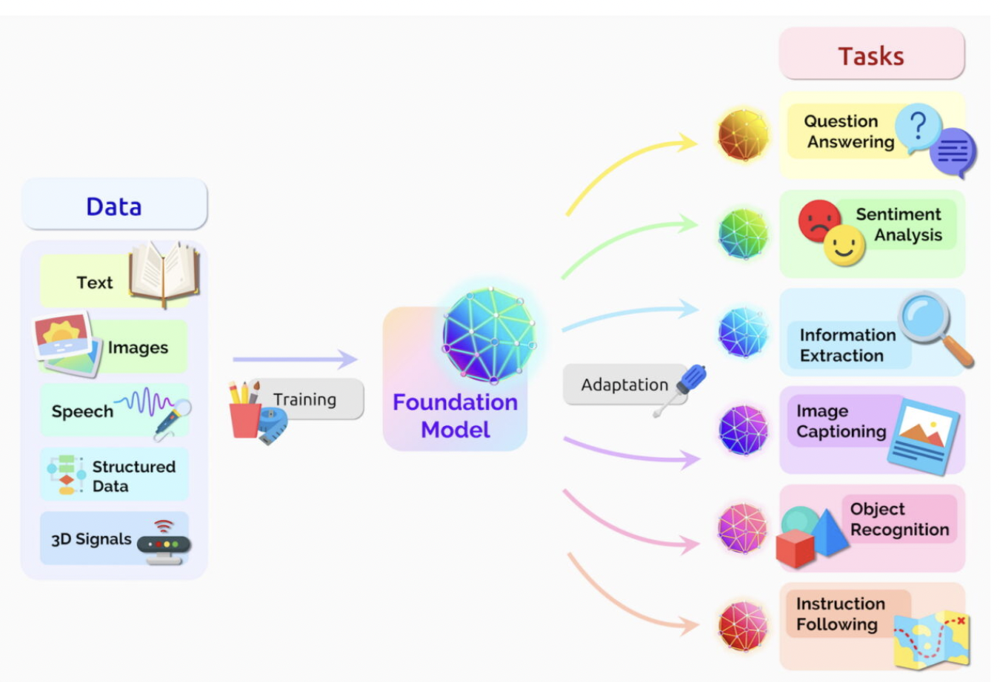
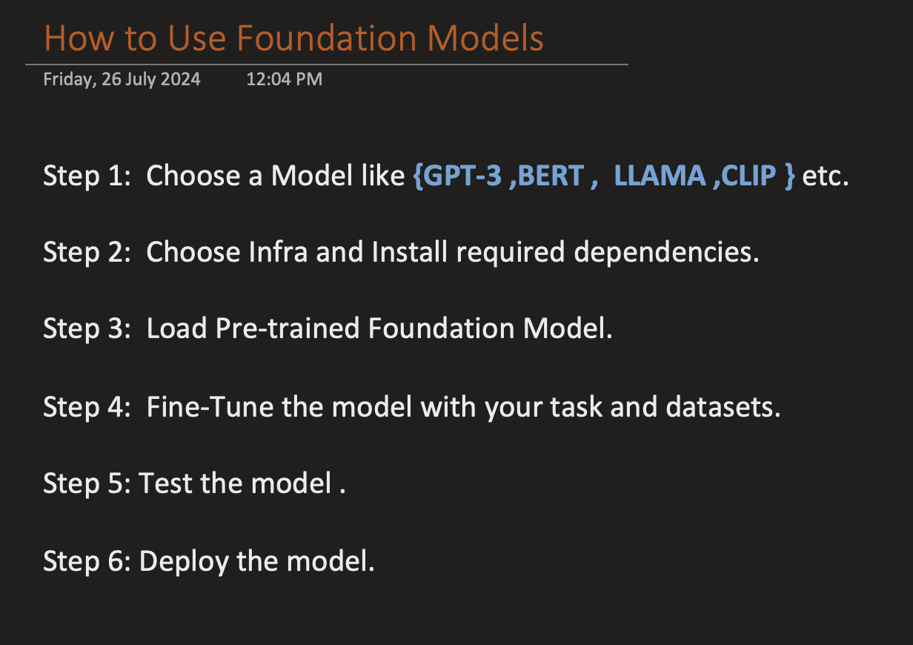

# Foundation Model

A foundation model is a pre-trained model on a large and diverse dataset that can be adapted or fine-tuned for a wide range of specific tasks. These models are designed to provide a robust starting point for numerous applications by capturing broad and generalizable patterns from their extensive training.

## We can reuse foundation models to train and customized for our personal tasks 

### Using Foundation Model 

