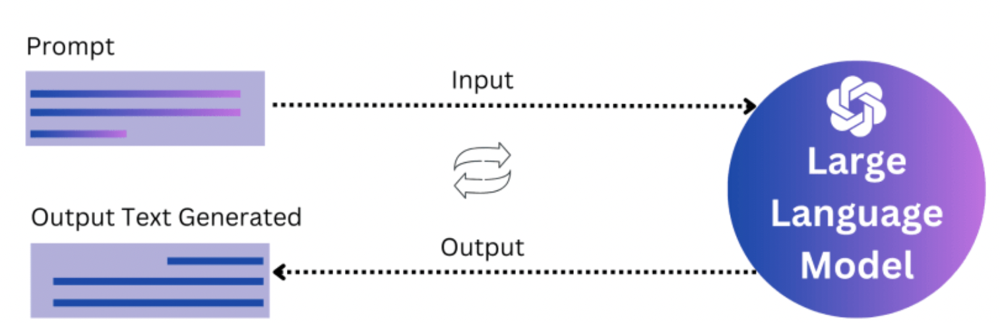

# Prompt Engineering

## Visual look 

Prompt engineering is the process of designing and refining inputs (prompts) given to language models, like GPT, to generate desired outputs effectively and accurately. It involves understanding the capabilities and limitations of the model and crafting prompts that guide the model to produce the most relevant and useful responses.

## Key Concepts in Prompt Engineering

### 1. Understanding the Model
- **Contextual Awareness**: The model generates responses based on the context provided in the prompt. The more contextually rich and clear the prompt, the better the output.
- **Limitations**: Models have limitations, such as potential biases or the inability to understand very recent information if the knowledge cut-off is older.

### 2. Prompt Structure
- **Clarity**: A well-defined prompt with clear instructions leads to more precise answers.
- **Specificity**: The more specific the prompt, the more targeted the response. This reduces ambiguity.
- **Length**: Balance is key. Too short might not provide enough context; too long might confuse the model.

### 3. Types of Prompts
- **Direct Prompts**: Clearly ask for what you want (e.g., "Explain the concept of machine learning in simple terms").
- **Indirect Prompts**: Pose questions or scenarios that lead the model to infer the desired output (e.g., "What might a beginner need to know about machine learning?").
- **Multi-turn Prompts**: Using a series of questions or instructions to gradually build toward a complex response.

### 4. Iterative Refinement
- **Testing and Feedback**: Generate responses using different prompts, compare them, and refine based on the quality of the outputs.
- **Error Analysis**: Understanding where and why the model might give incorrect or less useful answers and adjusting the prompt accordingly.

### 5. Advanced Techniques
- **Few-shot Learning**: Providing examples within the prompt to guide the model on how to respond (e.g., "Here are three examples of metaphors: 'Time is a thief,' 'The world is a stage,' ... Now, create a metaphor for a fast computer").
- **Chain-of-Thought**: Asking the model to break down complex tasks step-by-step (e.g., "List the steps involved in training a machine learning model").

## Applications of Prompt Engineering

1. **Content Creation**: Crafting prompts to generate articles, summaries, or creative writing.
2. **Data Analysis**: Using prompts to extract insights or generate hypotheses from data descriptions.
3. **Automation**: Designing prompts for automating repetitive tasks, like customer support or code generation.
4. **Conversational Agents**: Creating prompts that enable natural and helpful dialogues in chatbots and virtual assistants.

## Challenges
- **Bias and Ethics**: Ensuring that prompts do not inadvertently encourage biased or unethical outputs.
- **Complex Tasks**: For very specialized or intricate tasks, it may be challenging to design prompts that consistently yield accurate results.

In summary, prompt engineering is about harnessing the full potential of language models by carefully crafting inputs to guide the model's outputs effectively, whether for generating content, solving problems, or automating processes.
