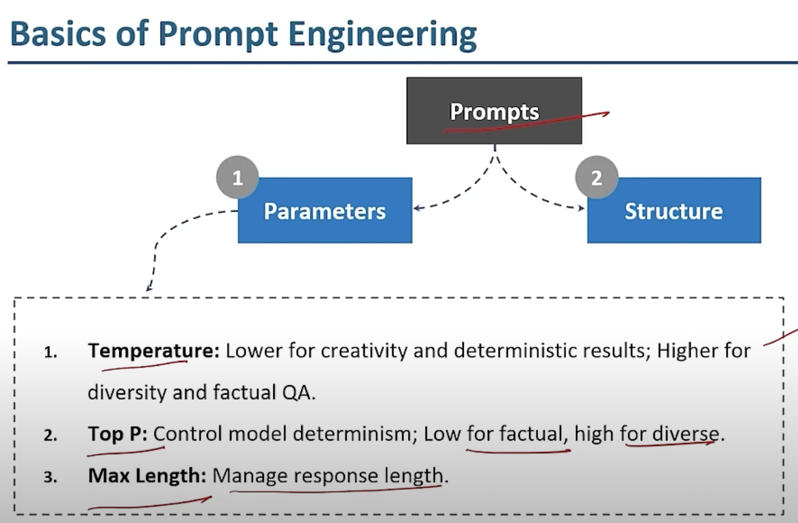
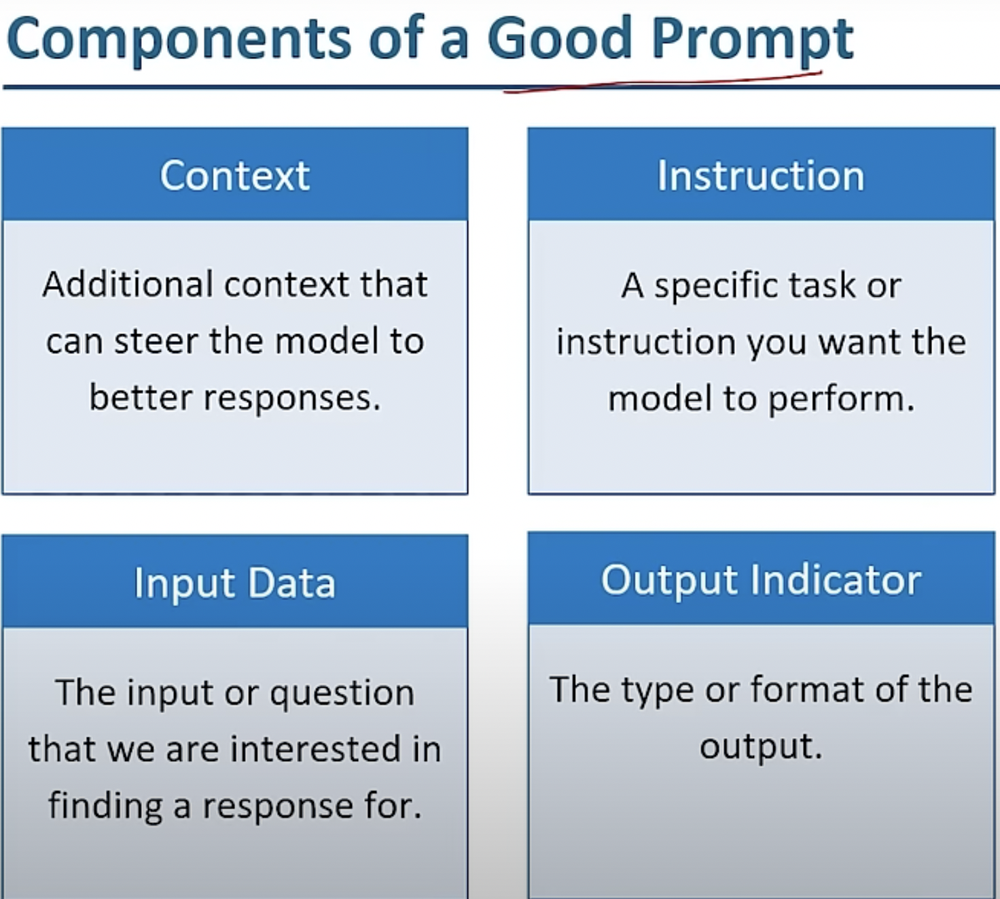
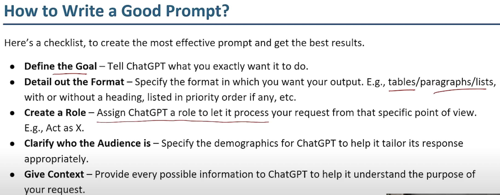
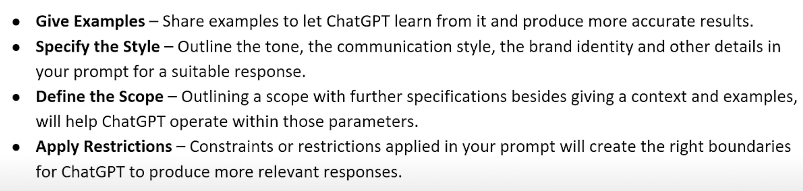
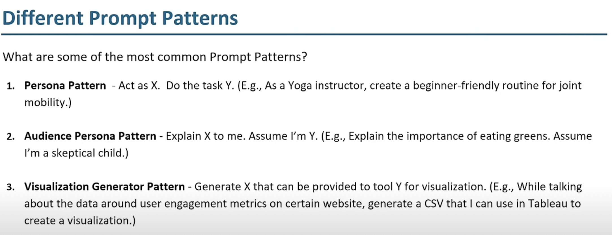
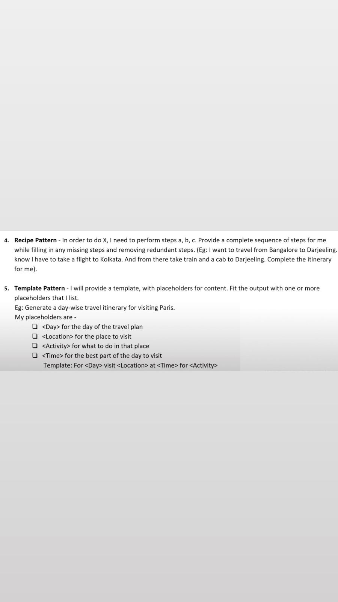
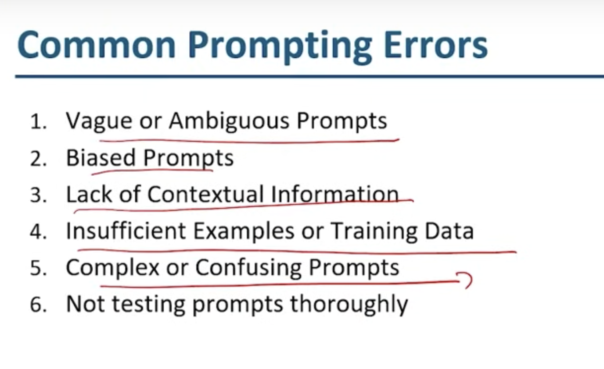

# updating_neurons

### Basic info about Prompts

### Components of prompts 

### A more Realistic approach 

# Prompt Structure and Parameters

A prompt can be understood in terms of its basic **structure** and **parameters**.

## Structure
- **Instruction**: Provides the overall task or direction for the model.
- **Context**: Supplies any necessary background or information to make the task clearer.
- **Query or Question**: Specifies the exact information or action needed from the model.

## Parameters
- **Length**: Defines how long the response should be (e.g., "in less than 100 words").
- **Tone**: Specifies the desired style or emotional tone (e.g., "formal," "casual").
- **Format**: Outlines how the response should be structured (e.g., "bulleted list," "paragraph").
- **Examples**: Provides sample outputs to guide the model (optional but useful for clarity).
- **Constraints**: Includes any specific limitations or requirements (e.g., "avoid technical jargon").

## Example Breakdown

### Structure
- **Instruction**: "Summarize the following text."
- **Context**: "The text is about the latest trends in renewable energy."
- **Query**: "What are the main trends highlighted?"

### Parameters
- **Length**: "Summarize in no more than 50 words."
- **Tone**: "Use a neutral, informative tone."
- **Format**: "Provide the summary as a single paragraph."
- **Examples**: (Optional) "For example, summarize the text like this: 'The main trends in renewable energy include solar advancements and wind power.'"
- **Constraints**: "Focus only on trends and avoid technical details."

## Summary
- **Structure**: Instruction + Context + Query
- **Parameters**: Length + Tone + Format + Examples + Constraints

## checklist of writing a prompt 

## Understanding prompt patterns 

## Common Prompting errors

