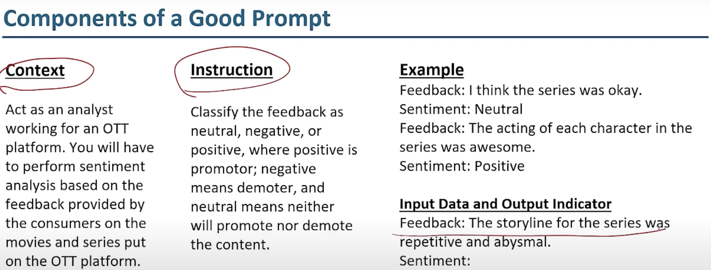

# updating_neurons

## Prompt example for NLP sentiment analysis 

## Prompt for Writing an email to HR for leave 

### Instruction
Write a professional and humble email to HR requesting sick leave in such a way that it has a high chance of approval.

### Context
The email should be directed to HR in an IT industry setting where understanding office workflows and dealing with rejections is important.

### Query
How can I request sick leave via email while ensuring it gets approved in most cases?

### Parameters
- **Length**: Keep the email body short and precise.
- **Tone**: Use a humble and professional tone.
- **Format**: The response should be in a paragraph format.

### Examples
Not required.

### Constraints
None.

