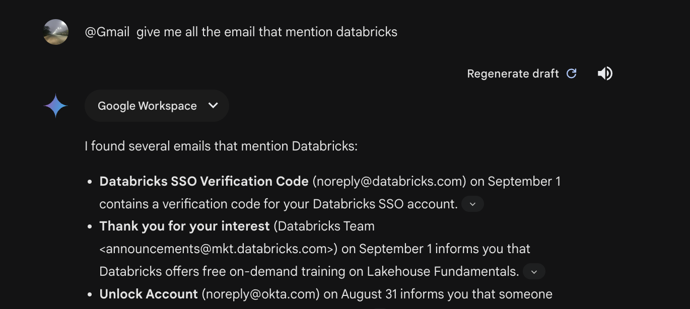
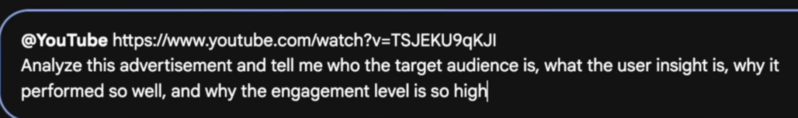
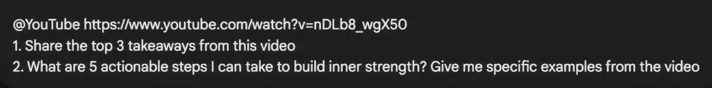

## Using prompts in Gemini 

### Searching on Gmail 



### flight searching 

```
@Gmail  find all flight confirmation emails this year

```

### searching on Drive 

```
@Google Drive Docs find all documents related invoice ? should be in pdf format
```

### demo 2

```
@Google Drive "Course_1_AWSEKSECS" only consider this specific file in your answer. your task is to analyze the file and give me overall summary and 5 takeways. 
```

### Doing analysis in youtube video 



### Doing analysis in youtube video 2



## Some More prompts 

## Storytelling

- **Creating a unique character:**  
  "Generate a detailed character profile for a time-traveling detective from the Victorian era who is secretly a robot."

- **Developing a plot twist:**  
  "Write a surprising plot twist for a sci-fi novel where the protagonist discovers they are actually an AI simulation."

- **Generating a dialogue scene:**  
  "Create a tense dialogue scene between a seasoned detective and a cunning criminal."

## Poetry

- **Writing in a specific style:**  
  "Compose a sonnet in the style of Shakespeare about the beauty of a sunset."

- **Exploring a particular theme:**  
  "Write a haiku about the fleeting nature of time."

- **Creating a unique rhyme scheme:**  
  "Generate a poem with an unusual rhyme scheme, such as ABCDDCBBA."

## Scripts

- **Generating a screenplay scene:**  
  "Write a screenplay scene where a superhero confronts a villain in a crowded city street."

- **Creating a dialogue for a character:**  
  "Write a dialogue scene for a character who is a witty, sarcastic AI assistant."

- **Developing a plot for a short film:**  
  "Generate a plot for a short film about a robot who dreams of becoming a human."

## Key Considerations for Effective Prompts:

- **Specificity:** The more specific your prompt, the more likely you are to get the desired output.
- **Context:** Provide relevant context or background information to help the model understand your request.
- **Constraints:** Set clear constraints, such as word count, tone, or style.
- **Creativity:** Encourage creativity by using open-ended prompts and
